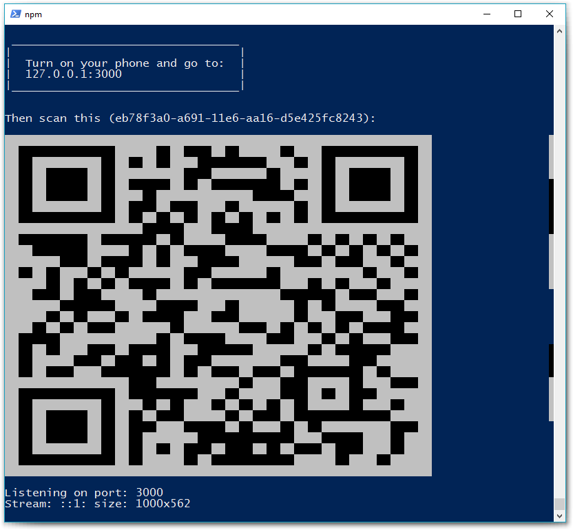

# node-vr-controller
Easily control vr apps using phone device motion



## Install

##### 1. `$ git clone https://github.com/jdtzmn/node-vr-controller.git`

##### 2. `$ npm install`

##### 3. `$ bower install`

## Usage
```bash
$ npm start -- -h

  Usage:
  npm start [-- <args>]

  Arguments:
  -h: Access this menu.
  -p [3000]: Change the host port.
  -d [720x405]: Change the video dimensions.
  -s ['12345']: Change the secret.
  -r [1]: Ratio of rotation of phone to speed of mouse.
  -i [false]: Invert the mouse movement (For computer control).
  --simulatevr [false]: Simulate a vr game by mirroring the screen.
  --noqr [false]: Disable the qr code for easy login feature.
```
## Code Style

[](https://github.com/feross/standard)
